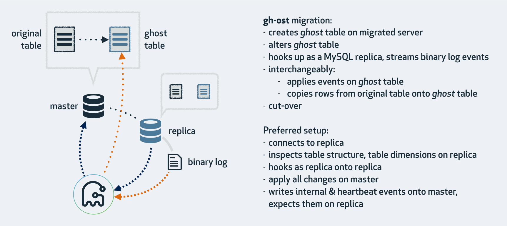

# gh-ost

  

#### GitHub's online schema migration for MySQL 

 `gh-ost` is a triggerless online schema migration solution for MySQL. It is testable and provides pausability, dynamic control/reconfiguration, auditing, and many operational perks.

`gh-ost` produces a light workload on the master throughout the migration, decoupled from the existing workload on the migrated table.

It has been designed based on years of experience with existing solutions, and changes the paradigm of table migrations.

## How?

All existing online-schema-change tools operate in similar manner: they create a _ghost_ table in the likeness of your original table, migrate that table while empty, slowly and incrementally copy data from your original table to the _ghost_ table, meanwhile propagating ongoing changes (any `INSERT`, `DELETE`, `UPDATE` applied to your table) to the _ghost_ table. Finally, at the right time, they replace your original table with the _ghost_ table.

`gh-ost` uses the same pattern. However it differs from all existing tools by not using triggers. We have recognized the triggers to be the source of [many limitations and risks](doc/why-triggerless.md).

Instead, `gh-ost` [uses the binary log stream](doc/triggerless-design.md) to capture table changes, and asynchronously applies them onto the _ghost_ table. `gh-ost` takes upon itself some tasks that other tools leave for the database to perform. As result, `gh-ost` has greater control over the migration process; can truly suspend it; can truly decouple the migration's write load from the master's workload.

In addition, it offers many [operational perks](doc/perks.md) that make it safer, trustworthy and fun to use.

## Highlights

- Build your trust in `gh-ost` by testing it on replicas. `gh-ost` will issue same flow as it would have on the master, to migrate a table on a replica, without actually replacing the original table, leaving the replica with two tables you can then compare and satisfy yourself that the tool operates correctly. This is how we continuously test `gh-ost` in production.
- True pause: when `gh-ost` [throttles](doc/throttle.md), it truly ceases writes on master: no row copies and no ongoing events processing. By throttling, you return your master to its original workload
- Dynamic control: you can [interactively](doc/interactive-commands.md) reconfigure `gh-ost`, even as migration still runs. You may forcibly initiate throttling.
- Auditing: you may query `gh-ost` for status. `gh-ost` listens on unix socket or TCP.
- Control over cut-over phase: `gh-ost` can be instructed to postpone what is probably the most critical step: the swap of tables, until such time that you're comfortably available. No need to worry about ETA being outside office hours.
- External [hooks](doc/hooks.md) can couple `gh-ost` with your particular environment.

Please refer to the [docs](doc) for more information. No, really, read the [docs](doc).

## Usage

The [cheatsheet](doc/cheatsheet.md) has it all. You may be interested in invoking `gh-ost` in various modes:

- a _noop_ migration (merely testing that the migration is valid and good to go)
- a real migration, utilizing a replica (the migration runs on the master; `gh-ost` figures out identities of servers involved. Required mode if your master uses Statement Based Replication)
- a real migration, run directly on the master (but `gh-ost` prefers the former)
- a real migration on a replica (master untouched)
- a test migration on a replica, the way for you to build trust with `gh-ost`'s operation.

Our tips:

- [Testing above all](doc/testing-on-replica.md), try out `--test-on-replica` first few times. Better yet, make it continuous. We have multiple replicas where we iterate our entire fleet of production tables, migrating them one by one, checksumming the results, verifying migration is good.
- For each master migration, first issue a _noop_
- Then issue the real thing via `--execute`.

More tips:

- Use `--exact-rowcount` for accurate progress indication
- Use `--postpone-cut-over-flag-file` to gain control over cut-over timing
- Get familiar with the [interactive commands](doc/interactive-commands.md)

Also see:

- [requirements and limitations](doc/requirements-and-limitations.md)
- [common questions](doc/questions.md)
- [what if?](doc/what-if.md)
- [the fine print](doc/the-fine-print.md)
- [Community questions](https://github.com/github/gh-ost/issues?q=label%3Aquestion)
- [Using `gh-ost` on AWS RDS](doc/rds.md)
- [Using `gh-ost` on Azure Database for MySQL](doc/azure.md)

## What's in a name?

Originally this was named `gh-osc`: GitHub Online Schema Change, in the likes of [Facebook online schema change](https://www.facebook.com/notes/mysql-at-facebook/online-schema-change-for-mysql/430801045932/) and [pt-online-schema-change](https://www.percona.com/doc/percona-toolkit/2.2/pt-online-schema-change.html).

But then a rare genetic mutation happened, and the `c` transformed into `t`. And that sent us down the path of trying to figure out a new acronym. `gh-ost` (pronounce: _Ghost_), stands for GitHub's Online Schema Transmogrifier/Translator/Transformer/Transfigurator

## License

`gh-ost` is licensed under the [MIT license](https://github.com/github/gh-ost/blob/master/LICENSE)

`gh-ost` uses 3rd party libraries, each with their own license. These are found [here](https://github.com/github/gh-ost/tree/master/vendor).

## Community

`gh-ost` is released at a stable state, but with mileage to go. We are [open to pull requests](https://github.com/github/gh-ost/blob/master/.github/CONTRIBUTING.md). Please first discuss your intentions via [Issues](https://github.com/github/gh-ost/issues).

We develop `gh-ost` at GitHub and for the community. We may have different priorities than others. From time to time we may suggest a contribution that is not on our immediate roadmap but which may appeal to others.

Please see [Coding gh-ost](doc/coding-ghost.md) for a guide to getting started developing with gh-ost.

## Download/binaries/source

`gh-ost` is now GA and stable.

`gh-ost` is available in binary format for Linux and Mac OS/X

[Download latest release here](https://github.com/github/gh-ost/releases/latest)

`gh-ost` is a Go project; it is built with Go `1.14` and above. To build on your own, use either:
- [script/build](https://github.com/github/gh-ost/blob/master/script/build) - this is the same build script used by CI hence the authoritative; artifact is `./bin/gh-ost` binary.
- [build.sh](https://github.com/github/gh-ost/blob/master/build.sh) for building `tar.gz` artifacts in `/tmp/gh-ost`

Generally speaking, `master` branch is stable, but only [releases](https://github.com/github/gh-ost/releases) are to be used in production.

## Authors

`gh-ost` is designed, authored, reviewed and tested by the database infrastructure team at GitHub:
- [@jonahberquist](https://github.com/jonahberquist)
- [@ggunson](https://github.com/ggunson)
- [@tomkrouper](https://github.com/tomkrouper)
- [@shlomi-noach](https://github.com/shlomi-noach)
- [@jessbreckenridge](https://github.com/jessbreckenridge)
- [@gtowey](https://github.com/gtowey)
- [@timvaillancourt](https://github.com/timvaillancourt)
