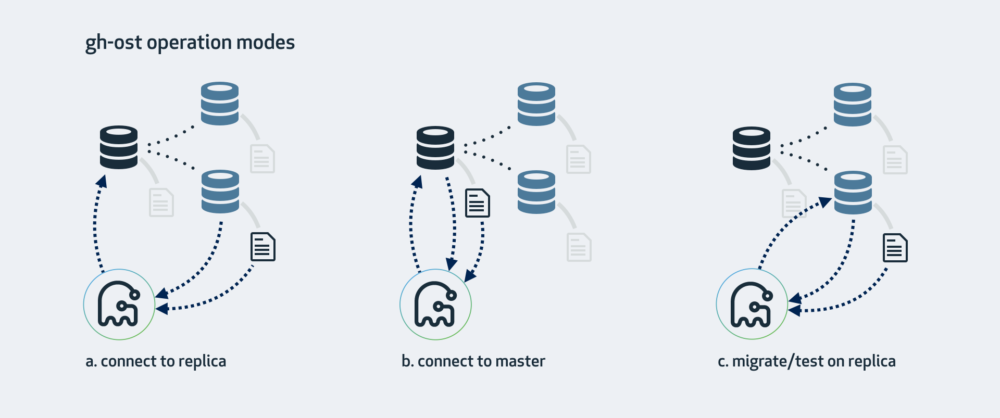

# Cheatsheet

### Operation modes




`gh-ost` operates by connecting to potentially multiple servers, as well as imposing itself as a replica in order to streamline binary log events directly from one of those servers. There are various operation modes, which depend on your setup, configuration, and where you want to run the migration.

#### a. Connect to replica, migrate on master

This is the mode `gh-ost` expects by default. `gh-ost` will investigate the replica, crawl up to find the topology's master, and will hook onto it as well. Migration will:

- Read and write row-data on master
- Read binary logs events on the replica, apply the changes onto the master
- Investigates table format, columns & keys, count rows on the replica
- Read internal changelog events (such as heartbeat) from the replica
- Cut-over (switch tables) on the master

If your master works with SBR, this is the mode to work with. The replica must be configured with binary logs enabled (`log_bin`, `log_slave_updates`) and should have `binlog_format=ROW` (`gh-ost` can apply the latter for you).

However even with RBR we suggest this is the least master-intrusive operation mode.

```shell
gh-ost \
--max-load=Threads_running=25 \
--critical-load=Threads_running=1000 \
--chunk-size=1000 \
--throttle-control-replicas="myreplica.1.com,myreplica.2.com" \
--max-lag-millis=1500 \
--user="gh-ost" \
--password="123456" \
--host=replica.with.rbr.com \
--database="my_schema" \
--table="my_table" \
--verbose \
--alter="engine=innodb" \
--switch-to-rbr \
--allow-master-master \
--cut-over=default \
--exact-rowcount \
--concurrent-rowcount \
--default-retries=120 \
--panic-flag-file=/tmp/ghost.panic.flag \
--postpone-cut-over-flag-file=/tmp/ghost.postpone.flag \
[--execute]
```

With `--execute`, migration actually copies data and flips tables. Without it this is a `noop` run.


#### b. Connect to master

If you don't have replicas, or do not wish to use them, you are still able to operate directly on the master. `gh-ost` will do all operations directly on the master. You may still ask it to be considerate of replication lag.

- Your master must produce binary logs in RBR format.
- You must approve this mode via `--allow-on-master`.

```shell
gh-ost \
--max-load=Threads_running=25 \
--critical-load=Threads_running=1000 \
--chunk-size=1000 \
--throttle-control-replicas="myreplica.1.com,myreplica.2.com" \
--max-lag-millis=1500 \
--user="gh-ost" \
--password="123456" \
--host=master.with.rbr.com \
--allow-on-master \
--database="my_schema" \
--table="my_table" \
--verbose \
--alter="engine=innodb" \
--switch-to-rbr \
--allow-master-master \
--cut-over=default \
--exact-rowcount \
--concurrent-rowcount \
--default-retries=120 \
--panic-flag-file=/tmp/ghost.panic.flag \
--postpone-cut-over-flag-file=/tmp/ghost.postpone.flag \
[--execute]
```

#### c. Migrate/test on replica

This will perform a migration on the replica. `gh-ost` will briefly connect to the master but will thereafter perform all operations on the replica without modifying anything on the master.
Throughout the operation, `gh-ost` will throttle such that the replica is up to date.

- `--migrate-on-replica` indicates to `gh-ost` that it must migrate the table directly on the replica. It will perform the cut-over phase even while replication is running.
- `--test-on-replica` indicates the migration is for purpose of testing only. Before cut-over takes place, replication is stopped. Tables are swapped and then swapped back: your original table returns to its original place.
Both tables are left with replication stopped. You may examine the two and compare data.

Test on replica cheatsheet:
```shell
gh-ost \
  --user="gh-ost" \
  --password="123456" \
  --host=replica.with.rbr.com \
  --test-on-replica \
  --database="my_schema" \
  --table="my_table" \
  --verbose \
  --alter="engine=innodb" \
  --initially-drop-ghost-table \
  --initially-drop-old-table \
  --max-load=Threads_running=30 \
  --switch-to-rbr \
  --chunk-size=500 \
  --cut-over=default \
  --exact-rowcount \
  --concurrent-rowcount \
  --serve-socket-file=/tmp/gh-ost.test.sock \
  --panic-flag-file=/tmp/gh-ost.panic.flag \
  --execute
```

### cnf file

You may use a `cnf` file in the following format:

```
[client]
user=gh-ost
password=123456
```

You may then remove `--user=gh-ost --password=123456` and specify `--conf=/path/to/config/file.cnf`


### Special configurations

#### Master-master

Master-master setups are supported, but at this time only active-passive. An active-active setup, where both masters write to the migrated table, is not supported at this stage. `gh-ost` requires you to acknowledge master-master via:

```
gh-ost --allow-master-master
```

`gh-ost` will pick one of the masters to work on. You may additionally force `gh-ost` to pick a particular master of your choice:

```
gh-ost --allow-master-master --assume-master-host=a.specific.master.com
```

#### Tungsten

Topologies using _tungsten replicator_ are peculiar in that the participating servers are not actually aware they are replicating. The _tungsten replicator_ looks just like another app issuing queries on those hosts. `gh-ost` is unable to identify that a server participates in a _tungsten_ topology.

If you choose to migrate directly on master (see above), there's nothing special you need to do.

If you choose to migrate via replica, then you need to make sure Tungsten is configured with log-slave-updates parameter (note this is different from MySQL's own log-slave-updates parameter), otherwise changes will not be in the replica's binlog, causing data to be corrupted after table swap. You must also supply the identity of the master, and indicate this is a tungsten setup, as follows:

```
gh-ost --tungsten --assume-master-host=the.topology.master.com
```

Also note that `--switch-to-rbr` does not work for a Tungsten setup as the replication process is external, so you need to make sure `binlog_format` is set to ROW before Tungsten Replicator connects to the server and starts applying events from the master.

### Concurrent migrations

It is possible to run concurrent `gh-ost` migrations.

- Never on the exact same table.
- If running on different replicas, (e.g. `table1` on `replica1` and `table2` on `replica2`) then no further configuration required.
- If running from same server (binaries run on same server, regardless of which replica/replicas are used):
  - Make sure not to specify same `-serve-socket-file` (or let `gh-ost` pick one for you).
  - You may choose to use same `-throttle-flag-file` (preferably use `-throttle-additional-flag-file`, this is exactly the reason there's two, this latter file is for sharing).
  - You may choose to use same `-panic-flag-file`. This all depends on your flow and how you'd like to control your migrations.
- If using same inspected box (either master or replica, `--host=everyone.uses.this.host`) then for each `gh-ost` process you must also provide a different, unique `--replica-server-id`. Optionally use process ID (`$$` in shell) ; but it's on you to choose a number that does not collide with another `gh-ost` or another running replica.
